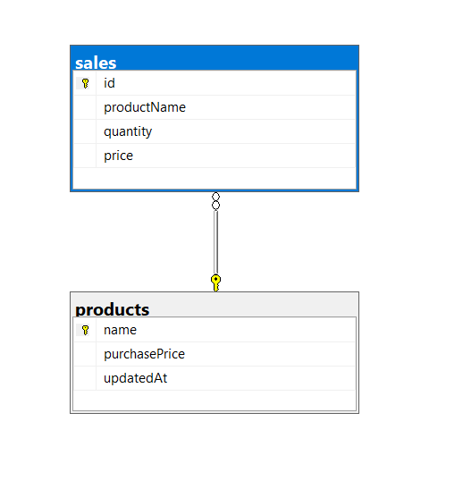

### User Stories
        1- User uploads Purchase & sales data within files of type CSV or Excel file

        2-User gets the top N items Based on sales of the item (N is user input Parameter)

        3-User gets the deadstock items based on low sales

        4-User views Profit report for every item

        5-User can find the data of specific item by searching with its name

### ERD
