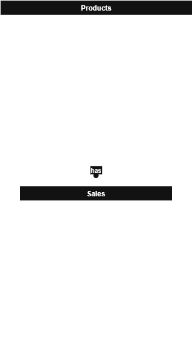

# 📊 Purchase & Sales Analytics API

A high-performance .NET 8 Web API for bulk ingestion and analysis of purchase and sales data from Excel/CSV files. Built with Clean Architecture, designed to handle **1M+ rows in under 0.35 seconds**.

[](https://github.com/AhmedMTwab/Purchase-Sales-Analysis-Task)
[](https://dotnet.microsoft.com/)
[](https://www.microsoft.com/sql-server)

---

## 🚀 Features

- **Bulk Data Ingestion** — Upload Excel (XLSX) or CSV files; data is parsed and inserted via batched bulk operations
- **1M+ Rows in 0.35s** — Optimized using `EFCore.BulkExtensions` with configurable batch sizes (default: 20,000 rows)
- **Automatic Product Detection** — Products not found in the database are auto-created during sales upload
- **Analytics Endpoints** — Query profit reports, top/bottom-selling products, and parameterized product search
- **Clean Architecture** — Domain, Application, Infrastructure, and API layers fully separated
- **Global Exception Handling** — All errors returned as structured JSON responses
- **Swagger Documentation** — Interactive API docs available at the root URL

---

## 🏗️ Architecture

```
SRC/
├── Purchase&Sales_API/             # Presentation Layer — Controllers, Middleware, Program.cs
├── Purchase&Sales_Core/            # Application Layer — Services, Use Cases, Interfaces
├── Purchase&Sales_Domain/          # Domain Layer — Entities, Enums (no external dependencies)
├── Purchase&Sales_Infrastructure/  # Infrastructure Layer — EF Core, Repositories, BulkExtensions
```

**Why Clean Architecture?**
Each layer only depends on the one below it. The domain has zero external dependencies — business rules stay isolated from infrastructure concerns like databases and file parsing.

---

## 🛠️ Tech Stack

| Category | Technology |
|---|---|
| Framework | ASP.NET Core Web API (.NET 8) |
| ORM | Entity Framework Core |
| Bulk Operations | EFCore.BulkExtensions |
| CSV Parsing | CsvHelper |
| Excel Parsing | EPPlus (OfficeOpenXml) |
| Database | SQL Server |
| API Docs | Swagger / Swashbuckle |
| DI | Built-in .NET DI |

---

## 📚 API Endpoints

### Data Ingestion
| Method | Endpoint | Description |
|---|---|---|
| `POST` | `/api/Purchase/upload` | Upload purchase data (XLSX or CSV) |
| `POST` | `/api/Sales/upload` | Upload sales data (XLSX or CSV) |

### Analytics
| Method | Endpoint | Description |
|---|---|---|
| `GET` | `/api/Analytics/profit` | Product profit report |
| `GET` | `/api/Analytics/top-sold` | Most sold products |
| `GET` | `/api/Analytics/least-sold` | Least sold / deadstock products |
| `GET` | `/api/Analytics/search` | Search products by name or category |

---

## ⚡ Performance Design

The ingestion pipeline is built around three principles:

1. **Streaming parsing** — Files are read row-by-row, never loaded fully into memory
2. **Batch processing** — Rows are grouped into batches of 20,000 before hitting the database
3. **Bulk insert** — `EFCore.BulkExtensions` bypasses EF's change tracker and writes directly via SqlBulkCopy

This combination is what achieves the **1M rows in 0.35 seconds** benchmark.

---

## 📦 Getting Started

### Prerequisites
- .NET 8 SDK
- SQL Server (local or remote)

### Setup

1. **Clone the repository**
   ```bash
   git clone https://github.com/AhmedMTwab/Purchase-Sales-Analysis-Task.git
   cd Purchase-Sales-Analysis-Task
   ```

2. **Configure the database connection** in `appsettings.json`
   ```json
   {
     "ConnectionStrings": {
       "DefaultConnection": "Server=.;Database=PurchaseSalesDb;Trusted_Connection=True;"
     }
   }
   ```

   > **📌 Database Connection Note**: This application is connected to a deployed database, so you don't need to change the connection string. However, if the deployed database fails or you want to use your own database, you can update the connection string above.

3. **Apply migrations**
   ```bash
   dotnet ef database update --project SRC/Purchase&Sales_Infrastructure
   ```

4. **Run the application**
   ```bash
   dotnet run --project SRC/Purchase&Sales_API
   ```

5. **Open Swagger UI** at `https://localhost:5001` (or the port shown in your console)

---

## 🗄️ Database Diagram



---

## 📝 Notes

- Large files are processed in configurable batches — adjust `BatchSize` in `appsettings.json` based on your server memory
- Auto-created products during sales upload are flagged for review via the product search endpoint
- All unhandled exceptions are caught globally and returned as structured JSON with appropriate HTTP status codes

---

## 👤 Author

**Ahmed Mohamed Eltwab**
[](https://linkedin.com/in/ahmed-twab)
[](https://github.com/AhmedMTwab)
